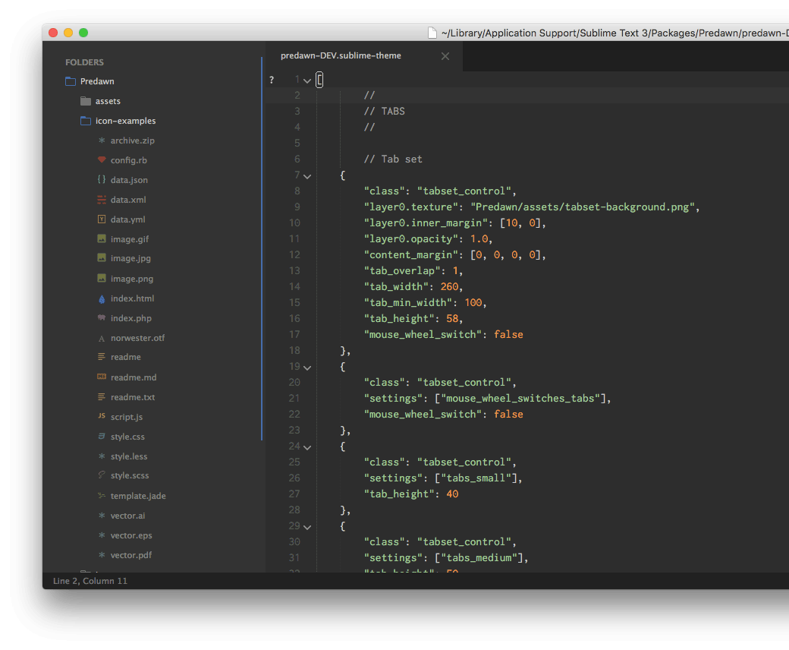

# Postdawn

This is an override for the Predawn interface theme, for recent versions of SublimeText 3.

IT IS NOT A COMPLETE THEME. You must install the original Predawn first and use this to override it.

Contrast and color is reduced and shifted (from orange to blue), and icons are lifted from the recent Material Design theme.

## To Install

1. Install the original Predawn theme via Package Control. This will cause the `Predawn.sublime-package` file to be placed in the 'Installed Packages' directory. Activate the theme using the options for newer SublimeText builds (greater than 3062).
2. Download this repo, rename it to "Predawn" and place it in the 'Packages' directory. Files and settings of this repo will take precedence over the `.sublime-package` file.